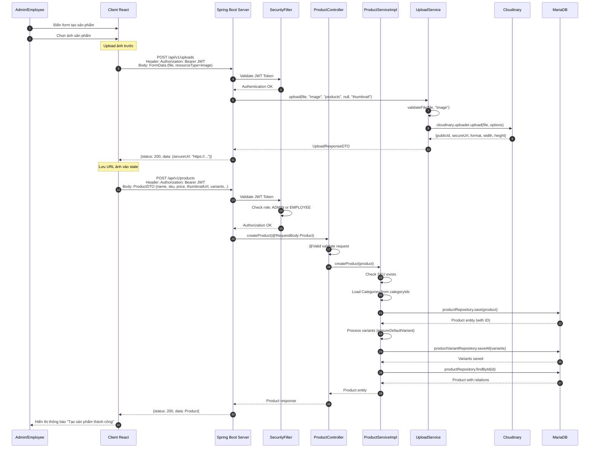
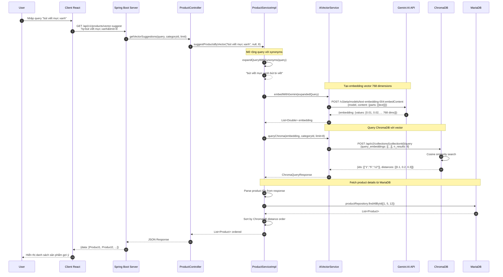
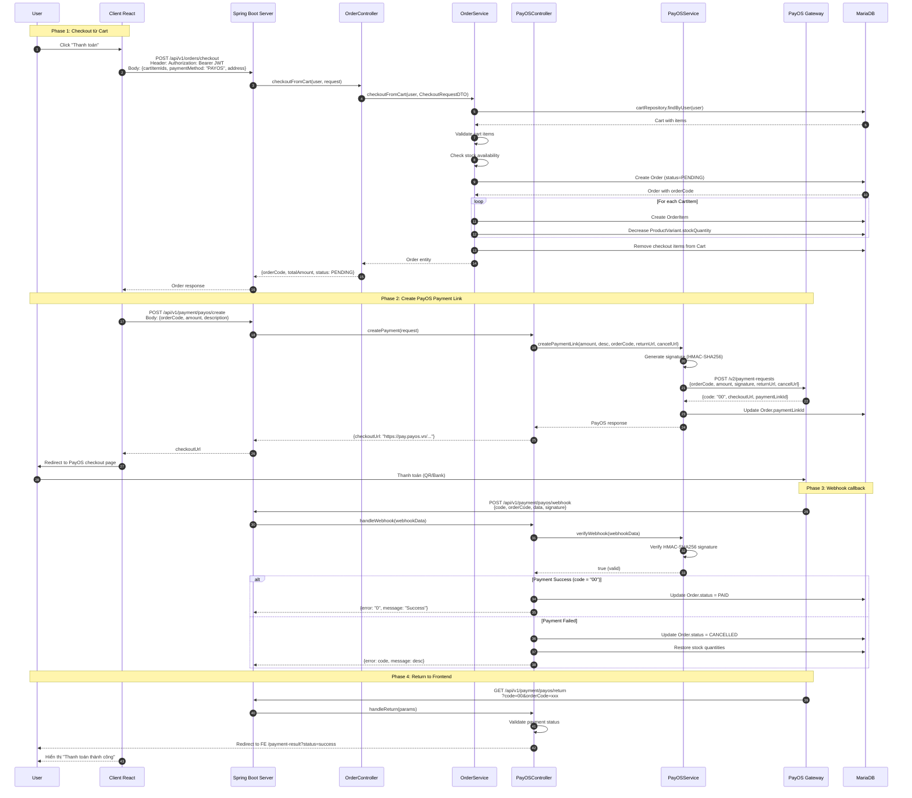
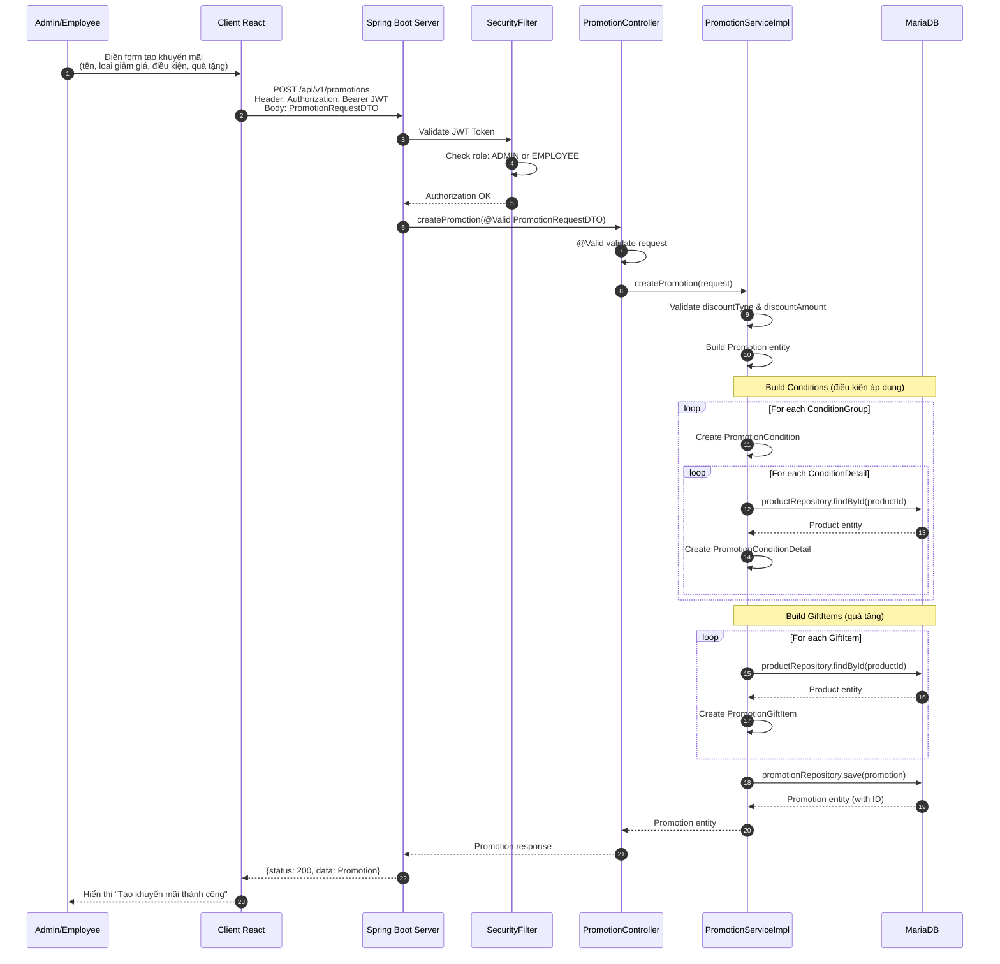
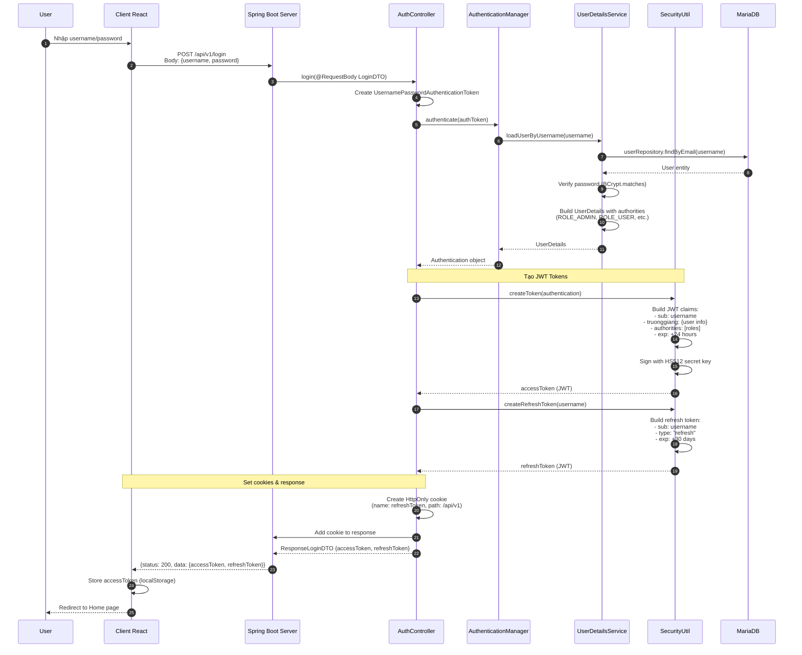
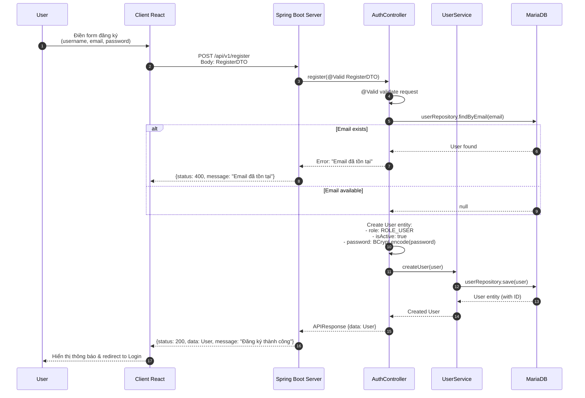
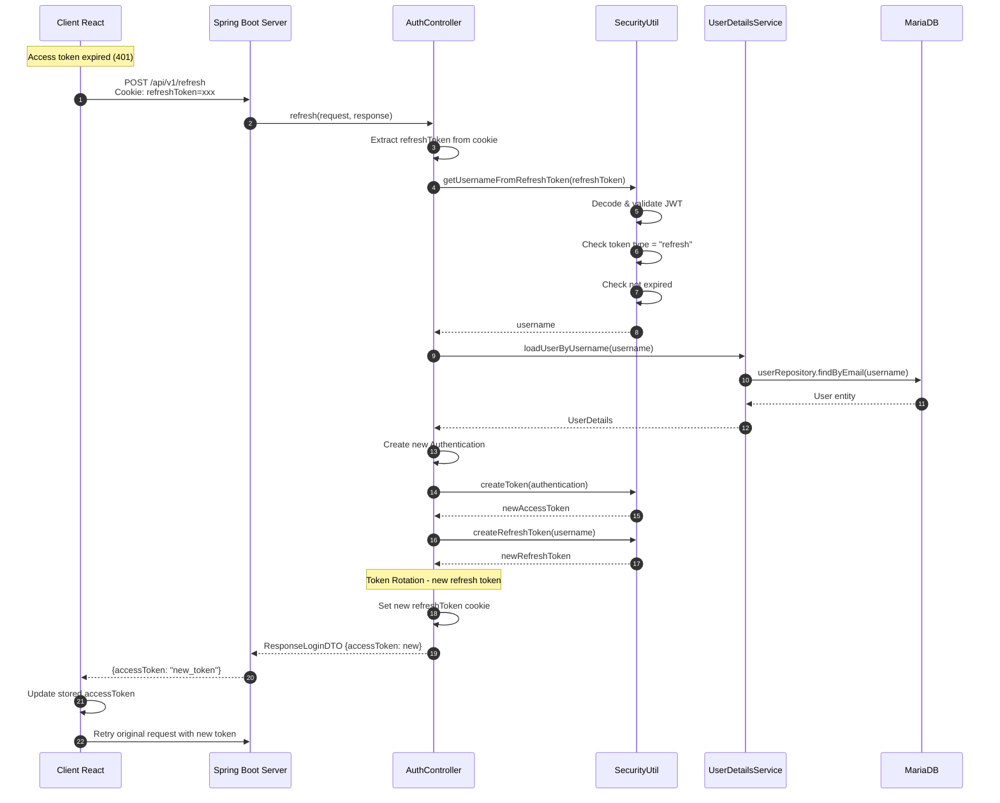
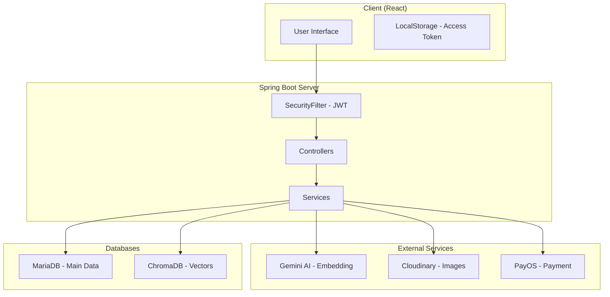

# Sơ Đồ Tuần Tự Chi Tiết - Các Use Case Hệ Thống

> Tài liệu mô tả chi tiết luồng hoạt động của từng use case với sự tham gia của các thành phần: **Client (React)**, **Server (Spring Boot)**, **MariaDB**, **ChromaDB**, **Cloudinary**, **Gemini AI**, **PayOS Gateway**.

---

## 1. Tạo Sản Phẩm (Create Product)

### 1.1 Mô tả
Admin/Employee tạo sản phẩm mới với thông tin chi tiết và upload ảnh lên Cloudinary.

### 1.2 Các thành phần tham gia
| Thành phần | Vai trò |
|------------|---------|
| **Client (React)** | Giao diện nhập thông tin sản phẩm |
| **Server (Spring Boot)** | Xử lý logic, validate, lưu dữ liệu |
| **Cloudinary** | Lưu trữ hình ảnh sản phẩm |
| **MariaDB** | Lưu trữ thông tin sản phẩm |

### 1.3 Sơ đồ tuần tự



### 1.4 Chi tiết từng bước

| Step | Actor | Service | Action | Data In | Data Out |
|------|-------|---------|--------|---------|----------|
| 1-2 | User | Client | Điền form | - | FormData |
| 3 | Client | Server | POST /uploads | file, JWT | - |
| 4-5 | Server | SecurityFilter | Validate JWT | JWT Token | Auth OK |
| 6-7 | Server | UploadService | Validate & Upload | file | - |
| 8-9 | UploadService | Cloudinary | Upload image | file bytes | URL, publicId |
| 10-11 | Server | Client | Return URL | - | secureUrl |
| 12 | Client | Server | POST /products | ProductDTO, JWT | - |
| 13-15 | Server | SecurityFilter | Auth + Role check | JWT | OK |
| 16-18 | ProductController | ProductService | Create product | Product | - |
| 19-22 | ProductService | MariaDB | Save product & variants | Entity | Saved entity |
| 23 | Server | Client | Return response | - | Product |

---

## 2. Gợi Ý Sản Phẩm AI (Vector-based Recommendation)

### 2.1 Mô tả
Hệ thống gợi ý sản phẩm dựa trên text query của user, sử dụng Gemini AI để tạo embedding và ChromaDB để tìm kiếm vector similarity.

### 2.2 Các thành phần tham gia
| Thành phần | Vai trò |
|------------|---------|
| **Client (React)** | Gửi query tìm kiếm |
| **Server (Spring Boot)** | Điều phối AI services |
| **Gemini AI (text-embedding-004)** | Tạo vector embedding từ text |
| **ChromaDB** | Vector database - tìm kiếm similarity |
| **MariaDB** | Lấy thông tin chi tiết sản phẩm |

### 2.3 Sơ đồ tuần tự



### 2.4 Chi tiết từng bước

| Step | Actor | Service | Action | Data In | Data Out |
|------|-------|---------|--------|---------|----------|
| 1-2 | User/Client | Server | Search request | query string | - |
| 3-5 | ProductService | - | Expand query | "bút viết" | "bút viết bút bi" |
| 6-9 | AiVectorService | Gemini API | Create embedding | text | float[768] |
| 10-14 | AiVectorService | ChromaDB | Vector similarity | embedding | product IDs |
| 15-17 | ProductService | MariaDB | Fetch products | IDs | Product list |
| 18-20 | Server | Client | Return results | - | JSON products |

---

## 3. Thanh Toán (Payment Flow - PayOS)

### 3.1 Mô tả
User checkout giỏ hàng và thanh toán qua PayOS gateway.

### 3.2 Các thành phần tham gia
| Thành phần | Vai trò |
|------------|---------|
| **Client (React)** | Giao diện checkout |
| **Server (Spring Boot)** | Xử lý order, tích hợp PayOS |
| **PayOS Gateway** | Xử lý thanh toán online |
| **MariaDB** | Lưu Order, OrderItems, cập nhật stock |

### 3.3 Sơ đồ tuần tự



### 3.4 Chi tiết từng bước

| Phase | Step | Actor | Service | Action | Data |
|-------|------|-------|---------|--------|------|
| 1 | 1-10 | User→Server | OrderService | Create Order | CartItems → Order |
| 1 | 11-13 | OrderService | MariaDB | Save Order, Items, Update Stock | Entities |
| 2 | 14-20 | Server | PayOS | Create payment link | orderCode → checkoutUrl |
| 2 | 21 | User | PayOS | Complete payment | Bank/QR |
| 3 | 22-27 | PayOS | Server | Webhook callback | Signature verify |
| 3 | 28-30 | Server | MariaDB | Update order status | PAID/CANCELLED |
| 4 | 31-33 | PayOS | Client | Redirect with result | status, message |

---

## 4. Tạo Khuyến Mãi (Create Promotion)

### 4.1 Mô tả
Admin/Employee tạo chương trình khuyến mãi với các điều kiện và quà tặng.

### 4.2 Các thành phần tham gia
| Thành phần | Vai trò |
|------------|---------|
| **Client (React)** | Giao diện quản lý khuyến mãi |
| **Server (Spring Boot)** | Xử lý logic promotion |
| **MariaDB** | Lưu Promotion, Conditions, GiftItems |

### 4.3 Sơ đồ tuần tự



### 4.4 Chi tiết dữ liệu

**Request PromotionRequestDTO:**
```json
{
  "name": "Mua 2 tặng 1",
  "thumbnailUrl": "https://cloudinary.com/...",
  "description": "Mua 2 sản phẩm được tặng 1",
  "discountType": "FREE_GIFT",
  "discountAmount": null,
  "conditions": [{
    "conditionType": "BUY_TOGETHER",
    "details": [
      {"productId": 1, "requiredQuantity": 2}
    ]
  }],
  "giftItems": [
    {"productId": 5, "quantity": 1}
  ]
}
```

| Step | Actor | Service | Action | Data |
|------|-------|---------|--------|------|
| 1-2 | User→Server | - | Send request | PromotionRequestDTO |
| 3-5 | SecurityFilter | - | Auth + Role check | JWT → OK |
| 6-9 | PromotionService | - | Validate & Build | DTO → Entity |
| 10-15 | PromotionService | MariaDB | Save conditions | Condition entities |
| 16-18 | PromotionService | MariaDB | Save gift items | GiftItem entities |
| 19-22 | PromotionService | MariaDB | Save promotion | Promotion entity |

---

## 5. Authentication (Đăng Nhập / Đăng Ký)

### 5.1 Mô tả
Xác thực người dùng qua username/password, tạo JWT token và refresh token.

### 5.2 Các thành phần tham gia
| Thành phần | Vai trò |
|------------|---------|
| **Client (React)** | Form đăng nhập/đăng ký |
| **Server (Spring Boot)** | Xử lý authentication |
| **BCrypt** | Mã hóa password |
| **JWT (SecurityUtil)** | Tạo và verify token |
| **MariaDB** | Lưu User, verify credentials |

### 5.3 Sơ đồ tuần tự - Login



### 5.4 Sơ đồ tuần tự - Register



### 5.5 Sơ đồ tuần tự - Refresh Token



### 5.6 Chi tiết JWT Token Structure

**Access Token Claims:**
```json
{
  "sub": "user@example.com",
  "truonggiang": {
    "id": 1,
    "username": "user",
    "email": "user@example.com",
    "roles": ["ROLE_USER"]
  },
  "authorities": ["ROLE_USER"],
  "iat": 1702134000,
  "exp": 1702220400
}
```

**Refresh Token Claims:**
```json
{
  "sub": "user@example.com",
  "type": "refresh",
  "iat": 1702134000,
  "exp": 1704726000
}
```

| Token Type | Lifetime | Storage | Usage |
|------------|----------|---------|-------|
| Access Token | 24 hours | localStorage | API requests header |
| Refresh Token | 30 days | HttpOnly Cookie | Get new access token |

---

## Tổng Kết Architecture



| Use Case | External Services | Databases |
|----------|------------------|-----------|
| Tạo sản phẩm | Cloudinary | MariaDB |
| Gợi ý AI | Gemini, ChromaDB | MariaDB |
| Thanh toán | PayOS | MariaDB |
| Khuyến mãi | - | MariaDB |
| Authentication | - | MariaDB |
